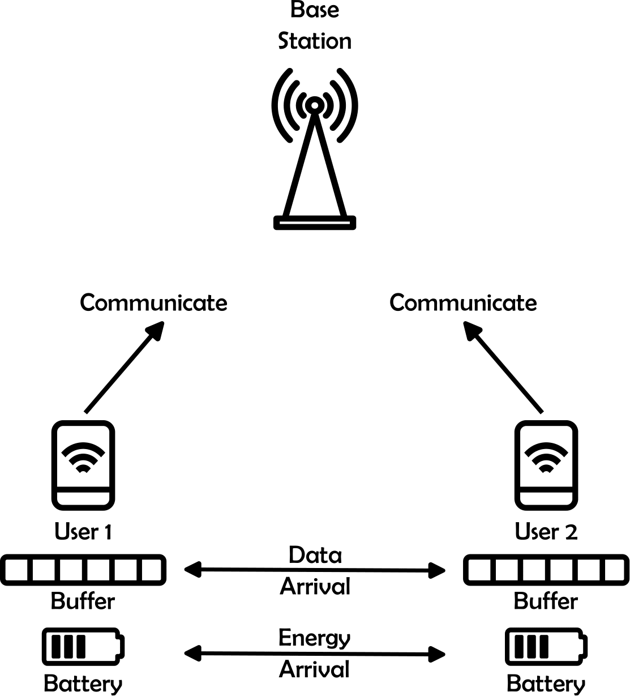

# RL-NOMA-Resource-Scheduling

**TL;DR**

This Lab was designed by [Abdelaziz Bounhar](https://github.com/BounharAbdelaziz) and [Ibrahim Djemai](https://github.com/IbraDje) in January 2024 for the [MICAS](https://www-ip--paris-fr.translate.goog/education/masters/mention-electronique-energie-electrique-et-automatique-e3a/master-year-2-machine-learning-communications-and-security?_x_tr_sl=en&_x_tr_tl=fr&_x_tr_hl=fr&_x_tr_pto=sc) Master 2 course on Reinforcement Learning (RL).
It covers from basic model-based RL algorithms to advanced model-free algorithms.

Communication networks commonly accommodate various applications with distinct security requirements, levels of importance, and delay constraints. In a context where only a given number of devices can communicate simultaneously, scheduling becomes a challenging problem. In particular, at each time instance, it has to be decided which devices should transmit and which communications can be deferred to a later stage.

This lab focuses on the **centralized scheduling problem** where a central entity (here, the base station) schedules the devices (here, two) based on global knowledge of the system. Efficient and optimal policies are derived to minimize packet loss while taking energy consumption into account.

<p align="center">

</p>

## Problem Statement

We consider the communication setup in the figure above. A Base Station (BS) serves two users. Both UEs wish to communicate a number of data packets (of some number of bits). The users store their data packets in a memory buffer while waiting for communication (we shall detail the buffer model in the following section).

Furthermore, both users are equipped with some semantic information. More specifically, for each user $u \in \{1,2\}$, the following attribute is assigned:

* $\Delta_u \in \mathbb{R}^+_0$: a **maximum delay constraint** that allows device $u$ to hold its packet in the buffer for $\Delta_u$ time slots; otherwise, the packets are removed from the buffer, and the agent is penalized.

At each time slot $t \in \mathcal{T}$, it has to be decided which user should transmit and which communication can be delayed to a later stage. In this setup, we consider the **centralized** case, i.e., the BS acts as the centralized decision center that selects which user should communicate and the number of data packets they can transmit.

Due to concerns related to computational complexity, we examine this problem in its simplest form. For each user $k \in \{1,2\}$, we assume a **maximum delay of 1**, enabling us to represent the buffer with a variable tracking the number of packets it contains. Additionally, the **maximum allowable packets in the buffer** is capped at **1**, and the **battery level** is constrained not to exceed **2 energy units**. Finally, we assume that the BS takes actions based on a **quantized** version of the channel. Therefore, the **channel** is modeled by a **3-level** (discrete) variable that indicates the quality of the SNR:
* Level 0: user 1 is the only one that can communicate,
* Level 1: user 2 is the only one that can communicate,
* Level 2: both users can communicate simultaneously.

Both **data arrival** and **energy arrival** are modeled by **Bernoulli** $\mathcal{B}(p)$ random variables for $p \in [0,1]$. In contrast, the channel quality **uniformly** transitions between states $\{0,1,2\}$.

## Markov Decision Processes

As the data buffer, battery, and channel state dynamics satisfy the Markov property, we can formulate the problem as a Markov Decision Process (MDP) for which we will describe the state and action spaces $\mathcal{S}$ and $\mathcal{A}$ respectively, as well as the reward model $R_t$.

### States and Actions Space

*States space*: We define our state space as a vector of:
- Buffer states of the two users, i.e., the vector $[D_1, D_2]$,
- Battery states of the two users, i.e., the vector $[B_1, B_2]$,
- The SNR level of the two users, i.e., the vector $[SNR_1, SNR_2]$.

We can thus write:

```math
\mathcal{S} = \{D_1, B_1, SNR_1, D_2, B_2, SNR_2\}.
```
This state space is of size:
```math
| \mathcal{S} | = \prod_{u=1}^2 \left[ \underbrace{(\Delta_u +1)^{1}}_{\text{Buffer space size}} \cdot \underbrace{(2 +1)}_{\text{Battery space size}} \cdot \underbrace{3}_{\text{SNR space size}} \right] = 324.
```

*Actions space*: We define our actions space as a vector of all possible decisions that can be made by the BS, i.e., how many (including 0) data packets to be transmitted. At each time instance $t \in \mathcal{T}$, each user $u \in \{1,2\}$ either **communicates** or remains **idle**. Therefore,
$$\mathcal{A} = \{0, \ldots, 3\}.$$
This actions space is of size:
```math
| \mathcal{A} | = 4.
```
which makes the state-action space of size $324 \cdot 4 = 1296$.

### Reward Model

The agent seeks to minimize the number of lost packets. The reward function for our problem will be the penalized sum:
```math
R_t = -\sum_{u=1}^{2} \sum_{j=1}^{2} \mathsf{1} \{D_u[j] > \Delta_u\}, \forall t \in \mathcal{T}.
```

As we formalize our problem as an Infinite Discounted Horizon problem, the overall reward function following a policy $\pi$ is defined as:
```math
R^{\pi} = \lim_{T \to \infty} \mathbb{E}^{\pi} \left[ \sum_{t=0}^T \gamma^t \cdot R_t \right],
```
with $\gamma$ being the discount factor.

## Approach: Optimal and Near-Optimal Policies via Model-based and Model-free Methods

To address the centralized scheduling problem, we will begin by deriving optimal policies using model-based methods, specifically **Value Iteration** and **Policy Iteration**. These methods, rooted in Dynamic Programming, enable us to leverage a known model of the environment to find optimal solutions. Value Iteration iteratively updates value estimates for each state until it converges to the optimal policy, while Policy Iteration alternates between evaluating a policy and improving it, refining the policy with each iteration until optimality is achieved. For further details, see foundational works on Value Iteration and Policy Iteration (Sutton & Barto, 2018).

Following the model-based approach, we will apply **model-free methods**, namely **Q-Learning** and **Deep Q-Networks**. Unlike model-based methods, Q-Learning learns the optimal policy without needing an explicit model of the environment, making it suitable for environments with unknown or dynamic transitions. In contrast, Deep Q-Networks extend Q-Learning by using neural networks to approximate the Q-values, enabling efficient learning in high-dimensional state-action spaces. The introduction of DQN by Mnih et al. (2015) marked a breakthrough in reinforcement learning for complex environments, and we will leverage it here to handle the challenges in our scheduling setup.

By applying these methods, we aim to compare and contrast model-based and model-free approaches in terms of their performance and suitability for the problem at hand. Specifically, we aim to analyze wetheir model free methods can learn the optimal solution.

**References**:
- Sutton, R. S., & Barto, A. G. (2018). *Reinforcement Learning: An Introduction* (2nd ed.). MIT Press.
- Watkins, C. J. C. H., & Dayan, P. (1992). *Q-Learning*. Machine Learning, 8, 279–292.

